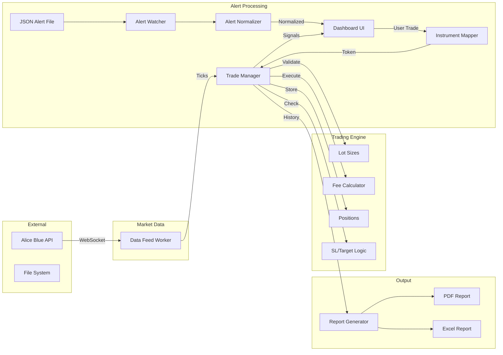
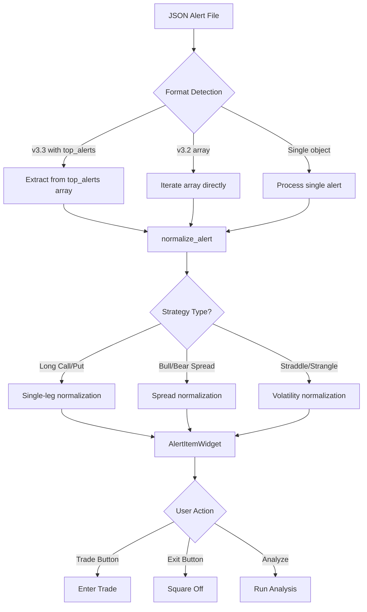
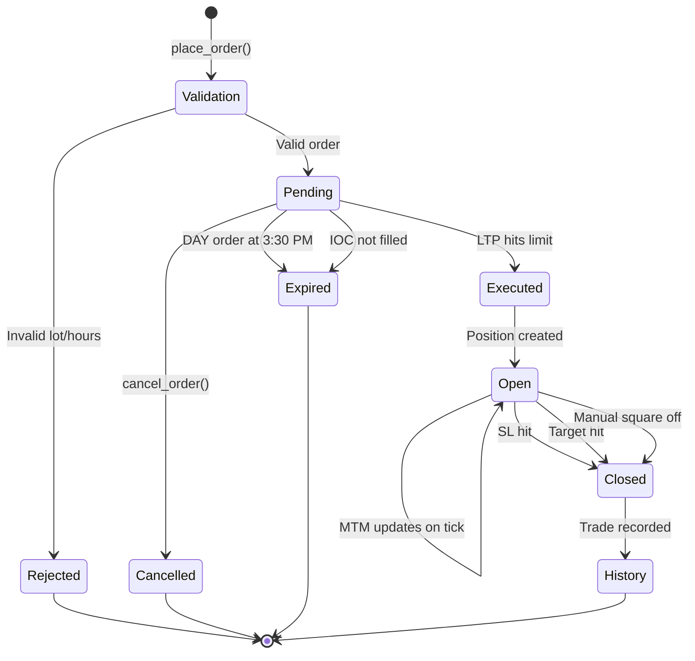

# Indian Options Paper Trading Application

A desktop paper trading application for Indian stock market options (NSE F&O segment) built with Python and PyQt6. Uses Alice Blue API for real-time market data.

## Features

- **Real-time Data Feed**: Live tick data via Alice Blue WebSocket API
- **Alert-Based Trading**: Watch a folder for JSON alert files and auto-execute trades
- **Realistic Order Execution**: Limit orders, stop-loss, target, slippage simulation
- **Position Management**: Multiple positions, averaging, MTM P&L tracking
- **Transaction Costs**: Configurable fees (brokerage, STT, exchange, SEBI, stamp duty, GST)
- **Lot Size Validation**: Enforces NSE lot sizes for all instruments
- **Market Hours Enforcement**: Validates trading hours (9:15 AM - 3:30 PM IST)
- **Order Types**: DAY, IOC, AMO order validity
- **Reporting**: Export trades to PDF and Excel
- **PostgreSQL Persistence**: Store trades, positions, and history in database
- **Session Resume**: Restore positions and state after app restart
- **Configuration Profiles**: Save and load different trading configurations

---

## Architecture Overview

```
┌─────────────────────────────────────────────────────────────────────────────┐
│                              PAPER TRADE APP                                │
├─────────────────────────────────────────────────────────────────────────────┤
│                                                                             │
│  ┌─────────────┐     ┌──────────────────────────────────────────────────┐  │
│  │   CONFIG    │     │                  UI LAYER                        │  │
│  │  config.py  │     │  ┌──────────────────────────────────────────┐   │  │
│  │             │     │  │           MainWindow (PyQt6)             │   │  │
│  │ - API Keys  │     │  │  ┌────────────┐  ┌──────────────────┐   │   │  │
│  │ - Slippage  │     │  │  │ Alert Feed │  │ Positions Table  │   │   │  │
│  │ - Fees      │     │  │  └────────────┘  └──────────────────┘   │   │  │
│  │ - Hours     │     │  │  ┌─────────────────────────────────────┐│   │  │
│  └─────────────┘     │  │  │          Log Console                ││   │  │
│                      │  │  └─────────────────────────────────────┘│   │  │
│                      │  └──────────────────────────────────────────┘   │  │
│                      └──────────────────────────────────────────────────┘  │
│                                        ▲                                    │
│                                        │ Signals                            │
│                                        ▼                                    │
│  ┌──────────────────────────────────────────────────────────────────────┐  │
│  │                        APP CONTROLLER (main.py)                       │  │
│  │                                                                       │  │
│  │   Orchestrates all components, handles signal routing                │  │
│  │   - Connects Data Feed → Trade Manager                               │  │
│  │   - Connects Alert Watcher → Instrument Mapper → Trade Manager       │  │
│  │   - Connects Trade Manager → UI                                      │  │
│  └──────────────────────────────────────────────────────────────────────┘  │
│                                        │                                    │
│            ┌───────────────────────────┼───────────────────────────┐       │
│            │                           │                           │       │
│            ▼                           ▼                           ▼       │
│  ┌──────────────────┐     ┌──────────────────┐     ┌──────────────────┐   │
│  │   ALERT WATCHER  │     │   DATA FEED      │     │  TRADE MANAGER   │   │
│  │  alert_watcher.py│     │  data_feed.py    │     │ trade_manager.py │   │
│  │                  │     │                  │     │                  │   │
│  │ - Watchdog FS    │     │ - AliceBlue WS   │     │ - Order Matching │   │
│  │ - JSON Parser    │     │ - Tick Stream    │     │ - Position Mgmt  │   │
│  │                  │     │ - Subscribe      │     │ - SL/Target      │   │
│  └────────┬─────────┘     └────────┬─────────┘     │ - P&L Calc       │   │
│           │                        │               │ - Fee Calc       │   │
│           ▼                        ▼               └────────┬─────────┘   │
│  ┌──────────────────┐     ┌──────────────────┐              │             │
│  │  alerts_inbox/   │     │   Alice Blue     │              │             │
│  │  *.json files    │     │   WebSocket      │              │             │
│  └──────────────────┘     └──────────────────┘              │             │
│                                                              ▼             │
│  ┌──────────────────┐     ┌──────────────────┐     ┌──────────────────┐   │
│  │ INSTRUMENT MAPPER│     │  FEE CALCULATOR  │     │ REPORT GENERATOR │   │
│  │instrument_mapper │     │ fee_calculator.py│     │report_generator  │   │
│  │                  │     │                  │     │                  │   │
│  │ - Symbol→Token   │     │ - Brokerage      │     │ - PDF Export     │   │
│  │ - Contract Master│     │ - STT/Taxes      │     │ - Excel Export   │   │
│  │ - Lot Sizes      │     │ - Configurable   │     │                  │   │
│  └──────────────────┘     └──────────────────┘     └──────────────────┘   │
│                                                                             │
│  ┌──────────────────┐     ┌──────────────────┐                             │
│  │   LOT SIZES      │     │   ALICE UTILS    │                             │
│  │   lot_sizes.py   │     │  alice_utils.py  │                             │
│  │                  │     │                  │                             │
│  │ - Index lots     │     │ - API Wrapper    │                             │
│  │ - Stock lots     │     │ - WebSocket      │                             │
│  │ - Validation     │     │ - Instruments    │                             │
│  └──────────────────┘     └──────────────────┘                             │
│                                                                             │
└─────────────────────────────────────────────────────────────────────────────┘
```

---

## Data Flow



### Alert Normalization Flow



---

## Component Details

### Core Components

| Component | File | Description |
|-----------|------|-------------|
| **App Controller** | `main.py` | Main orchestrator, initializes all components and wires signals |
| **Trade Manager** | `core/trade_manager.py` | Order matching engine, position management, P&L calculation |
| **Data Feed** | `core/data_feed.py` | Alice Blue WebSocket connection for live tick data |
| **Instrument Mapper** | `core/instrument_mapper.py` | Maps symbol names to exchange tokens using contract master |
| **Alert Watcher** | `core/alert_watcher.py` | Monitors folder for new JSON alert files (supports v3.2 and v3.3 formats) |
| **Alert Normalizer** | `core/alert_normalizer.py` | Converts alerts from various formats to trading system format, supports multi-leg strategies |
| **Fee Calculator** | `core/fee_calculator.py` | Calculates transaction costs (brokerage, taxes, charges) |
| **Lot Sizes** | `core/lot_sizes.py` | Validates order quantities against exchange lot sizes |
| **Report Generator** | `core/report_generator.py` | Exports trade history to PDF/Excel |
| **Alice Utils** | `core/alice_utils.py` | Low-level Alice Blue API wrapper |

### UI Components

| Component | File | Description |
|-----------|------|-------------|
| **Dashboard** | `ui/dashboard.py` | Main window with positions table, alert feed, logs |

---

## Order Lifecycle



---

## Configuration

Edit `config.py` to customize:

```python
# API Credentials
USER_ID = "your_user_id"
API_KEY = "your_api_key"

# Trading Settings
SLIPPAGE_PERCENT = 0.1          # 0.1% slippage on fills
ENFORCE_MARKET_HOURS = True     # Validate 9:15 AM - 3:30 PM
ALLOW_AMO = True                # Allow After Market Orders

# Fee Configuration
FEE_CONFIG_NAME = "ALICE_BLUE"  # Options: ALICE_BLUE, ZERODHA, FLAT_FEE, CUSTOM

# Database Persistence
ENABLE_PERSISTENCE = True       # Enable/disable PostgreSQL storage
DB_CONFIG = {
    "host": "localhost",
    "port": 5432,
    "database": "paper_trade",
    "user": "your_username",
    "password": ""
}
```

### Database Setup

1. Install PostgreSQL on your system
2. Create the database:
   ```bash
   createdb paper_trade
   ```
3. Update `config.py` with your PostgreSQL credentials
4. Tables are created automatically on first run

---

## Alert JSON Format

Place JSON files in `alerts_inbox/` folder. Supports multiple formats:

### Simple Format (Manual Alerts)

```json
{
    "symbol": "NIFTY",
    "expiry": "2025-01-30",
    "strike": 24000,
    "option_type": "CE",
    "action": "BUY",
    "price_limit": 150.0,
    "quantity": 50
}
```

### Screener Format v3.2 (Legacy - PascalCase)

```json
{
    "Timestamp": "2025-01-30 10:30:00",
    "Symbol": "NIFTY",
    "Type": "CE",
    "Strategy": "Long Call",
    "Strike": 24000,
    "Premium": 150.50,
    "PriceSource": "LTP",
    "Spot": 23850.25,
    "Volume": 125000,
    "OI": 5000000,
    "IV": 18.5,
    "IV_Percentile": 65,
    "Expiry": "2025-01-30",
    "DaysToExpiry": 7,
    "LotSize": 50,
    "TotalCost": 7525,
    "Breakeven": 24150.50
}
```

### Screener Format v3.3+ (Current - lowercase with multi-leg strategies)

The new v3.3 format uses lowercase field names and supports multi-leg strategies:

**Single-Leg Strategy (Long Call, Long Put)**
```json
{
    "timestamp": "2025-12-24 11:04:31",
    "symbol": "NIFTY",
    "instrument_type": "INDEX",
    "strategy": "Long Call",
    "strike": 26200,
    "premium": 106.85,
    "price_source": "ask",
    "spot": 26205.55,
    "volume": 1343716,
    "open_interest": 188853,
    "iv": 9.38,
    "iv_percentile": 0,
    "expiry": "30-Dec-2025",
    "days_to_expiry": 6,
    "lot_size": 25,
    "total_cost": 2671.25,
    "breakeven": 26306.85,
    "distance_from_spot": "-0.0% ITM"
}
```

**Spread Strategy (Bull Call Spread, Bear Put Spread)**
```json
{
    "timestamp": "2025-12-24 11:04:31",
    "symbol": "NIFTY",
    "instrument_type": "INDEX",
    "strategy": "Bull Call Spread",
    "strike": "26200/26300",
    "premium": 48.5,
    "price_source": "spread",
    "spot": 26205.55,
    "expiry": "30-Dec-2025",
    "days_to_expiry": 6,
    "lot_size": 25,
    "total_cost": 1212.5,
    "breakeven": 26248.5,
    "leg1": {
        "strike": 26200,
        "premium": 106.85,
        "action": "BUY"
    },
    "leg2": {
        "strike": 26300,
        "premium": 58.35,
        "action": "SELL"
    },
    "max_profit": 1287.5,
    "max_loss": 1212.5,
    "reward_ratio": 1.06
}
```

**Volatility Strategy (Long Straddle, Long Strangle)**
```json
{
    "timestamp": "2025-12-24 11:04:31",
    "symbol": "NIFTY",
    "instrument_type": "INDEX",
    "strategy": "Long Straddle",
    "strike": 26200,
    "premium": 190.95,
    "price_source": "straddle",
    "spot": 26205.55,
    "expiry": "30-Dec-2025",
    "days_to_expiry": 6,
    "lot_size": 25,
    "total_cost": 4773.75,
    "breakeven": "26009/26391",
    "distance_from_spot": "±0.7% to breakeven",
    "leg1": {
        "strike": 26200,
        "premium": 106.85,
        "action": "BUY CE"
    },
    "leg2": {
        "strike": 26200,
        "premium": 84.1,
        "action": "BUY PE"
    },
    "max_loss": 4773.75
}
```

**Batch Alert File (v3.3 format with metadata)**
```json
{
    "last_updated": "2025-12-24 11:06:05",
    "total_scanned": 470,
    "top_alerts_count": 15,
    "alerts_by_strategy": {
        "Long Straddle": 47,
        "Bull Call Spread": 46,
        "Long Call": 208
    },
    "top_alerts": [
        { "...alert1..." },
        { "...alert2..." }
    ]
}
```

### Supported Strategies

| Strategy | Type | Option Type | Description |
|----------|------|-------------|-------------|
| Long Call | Single-leg | CE | Buy call option |
| Long Put | Single-leg | PE | Buy put option |
| Bull Call Spread | Spread | CE | Buy lower strike, sell higher strike CE |
| Bear Put Spread | Spread | PE | Buy higher strike, sell lower strike PE |
| Long Straddle | Volatility | CE+PE | Buy ATM call and put (same strike) |
| Long Strangle | Volatility | CE+PE | Buy OTM call and put (different strikes) |

### Field Mapping

| v3.3 Field | v3.2 Field | Trading Field | Notes |
|------------|------------|---------------|-------|
| symbol | Symbol | symbol | Index/stock name |
| (inferred) | Type | option_type | CE, PE, STRADDLE, or STRANGLE |
| strategy | Strategy | action | "Long Call" → BUY, etc. |
| strike | Strike | strike | Strike price (can be "26200/26300" for spreads) |
| premium | Premium | price_limit | Entry price |
| expiry | Expiry | expiry | Date (supports "30-Dec-2025" or "2025-01-30") |
| lot_size | LotSize | quantity | Uses lot size as quantity (1 lot) |
| leg1, leg2 | (n/a) | leg1, leg2 | Multi-leg strategy details |
| max_profit | (n/a) | max_profit | Max profit for spreads |
| max_loss | (n/a) | max_loss | Max loss for spreads/straddles |

---

## Project Structure

```
paper_trade_app/
├── main.py                 # Application entry point
├── config.py               # Configuration settings
├── README.md               # This file
│
├── core/                   # Business logic
│   ├── __init__.py
│   ├── alice_utils.py      # Alice Blue API wrapper
│   ├── alert_normalizer.py # Alert format converter (v3.2/v3.3, multi-leg)
│   ├── alert_watcher.py    # File system watcher
│   ├── data_feed.py        # WebSocket data feed
│   ├── fee_calculator.py   # Transaction cost calculator
│   ├── instrument_mapper.py# Symbol to token mapping
│   ├── lot_sizes.py        # Lot size validation
│   ├── report_generator.py # PDF/Excel export
│   └── trade_manager.py    # Trading engine
│
├── ui/                     # User interface
│   └── dashboard.py        # Main window
│
├── alerts_inbox/           # Drop JSON alerts here
│   └── *.json
│
├── reports/                # Generated reports
│   ├── *.pdf
│   └── *.xlsx
│
├── data_cache/             # Contract master CSVs
│   └── NFO.csv
│
├── test_phase1.py          # Data feed tests
└── test_phase2.py          # Trade manager tests
```

---

## Installation

```bash
# Create virtual environment
python3 -m venv venv
source venv/bin/activate  # On Windows: venv\Scripts\activate

# Install dependencies
pip install PyQt6 pandas fpdf xlsxwriter websocket-client watchdog requests

# Run the application
python main.py
```

---

## Transaction Costs (Alice Blue Default)

| Component | Rate |
|-----------|------|
| Brokerage | ₹15 per executed order |
| STT (Options Buy) | 0% |
| STT (Options Sell) | 0.0625% of premium |
| Exchange Charges | 0.053% of premium |
| SEBI Charges | 0.0001% of turnover |
| Stamp Duty (Buy) | 0.003% |
| GST | 18% on (brokerage + exchange) |

---

## Signals Reference

| Signal | Payload | Description |
|--------|---------|-------------|
| `order_placed_signal` | `{order dict}` | New order placed |
| `order_filled_signal` | `{order dict}` | Order executed |
| `order_rejected_signal` | `{symbol, reason}` | Validation failure |
| `order_cancelled_signal` | `{order dict}` | Order cancelled |
| `order_modified_signal` | `{order_id, changes}` | Order modified |
| `sl_hit_signal` | `{order_id, exit_price, pnl}` | Stop-loss triggered |
| `target_hit_signal` | `{order_id, exit_price, pnl}` | Target reached |
| `pnl_update_signal` | `{token, ltp, net_pnl}` | MTM update |
| `total_pnl_signal` | `{realized, unrealized, fees}` | Summary P&L |

---

## License

This project is for educational/personal use. Not affiliated with Alice Blue or any broker.

---

## Disclaimer

This is a **paper trading** application for learning purposes only. No real orders are placed. Past performance does not guarantee future results. Always consult a financial advisor before trading.

Tier 1: Essential for Realistic Trading

#	Improvement	                    Why It Matters
1	Lot Size Validation	            Indian options trade in lots (NIFTY=25, BANKNIFTY=15, stocks vary). Invalid quantities should be rejected.
2	Transaction Costs	            Brokerage, STT, stamp duty, exchange fees, GST significantly impact real P&L, especially for scalping.
3	Stop-Loss & Target Orders	    Essential risk management. Auto-exit when SL/target is hit.
4	Order Cancellation/Modification	Cancel pending orders or modify limit price.
5	Multiple Orders Per Symbol	    Currently one order per token. Real trading allows multiple orders on same instrument.
Tier 2: Important for Accuracy
#	Improvement	Why It Matters
6	Slippage Simulation	Entry exactly at limit is unrealistic. Add configurable slippage (0.1-0.5%).
7	Order Validity (DAY/IOC)	DAY orders expire at 3:30 PM. IOC orders cancel if not filled immediately.
8	Market Hours Validation	Reject orders outside 9:15 AM - 3:30 PM IST.
9	Position Averaging	If you BUY 50 lots at ₹100, then BUY 50 more at ₹110, average should be ₹105.
10	Realized vs Unrealized P&L	Separate closed trade P&L from open position MTM.
Tier 3: Advanced/Optional
#	Improvement	Why It Matters
11	Trailing Stop-Loss	Dynamic SL that moves with price. Popular for trend-following.
12	Bracket Orders (BO)	Entry + SL + Target as a single unit.
13	Option Expiry Handling	Auto square-off on expiry day at 3:30 PM with settlement price.
14	Margin Tracking	Options selling requires margin. Track available margin.
15	Bid-Ask Spread Simulation	Real options have spreads (e.g., bid=100, ask=101). Affects fill prices.


Tier 1, Tier 2, and Tier 5 implemented
-----------------------------------------
Tier 3: Order Management Enhancements
Feature	                Description	                                        Complexity      Status
Trailing Stop-Loss	    SL moves up as price rises (e.g., 2% below peak)	Medium          Pending
Bracket Orders (OCO)	One Cancels Other - SL and Target linked	        Medium          Pending
GTT Orders	            Good Till Triggered - persist across sessions	    Medium          Pending
Multi-leg Orders	    Straddle, strangle, spreads as single order	        High            ✅ Alert Support (v3.3)
-------------------------------------------
Tier 4: Analytics & Visualization
Feature	                Description	                            Complexity
Live Price Charts	    Candlestick/line charts in dashboard	High
Equity Curve	        Visual P&L over time	                Medium
Performance Metrics	    Sharpe ratio, max drawdown, win rate	Low
Greeks Display	        Delta, Gamma, Theta, Vega for options	Medium
--------------------------------------------
Tier 5: Data Persistence ✅ IMPLEMENTED (PostgreSQL)
Feature	                Description	                            Status
PostgreSQL Database	    Store trades, positions, history	    ✅ Done
Session Resume	        Restore positions after app restart	    ✅ Done
Configuration Profiles	Save/load different trading configs	    ✅ Done
-------------------------
Tier 6: Notifications & Alerts
Feature	                    Description	                        Complexity
Sound Alerts	            Audio on fill, SL hit, target hit	Low
System Tray Notifications	Desktop popups	                    Low
Telegram Bot	            Trade notifications to phone	    Medium
--------------------------
Tier 7: Strategy Features
Feature	Description	Complexity
Strategy Templates	Pre-built option strategies	Medium
Backtesting	Test strategies on historical data	High
Rule Engine	Automated entry/exit conditions	High
---------------------------
Tier 8: Risk Management
Feature	                Description	                            Complexity
Daily Loss Limit	    Auto-stop trading after X loss	        Low
Position Sizing	Kelly   criterion, fixed fractional	            Medium
Margin Simulation	    Track required margin realistically	    Medium
