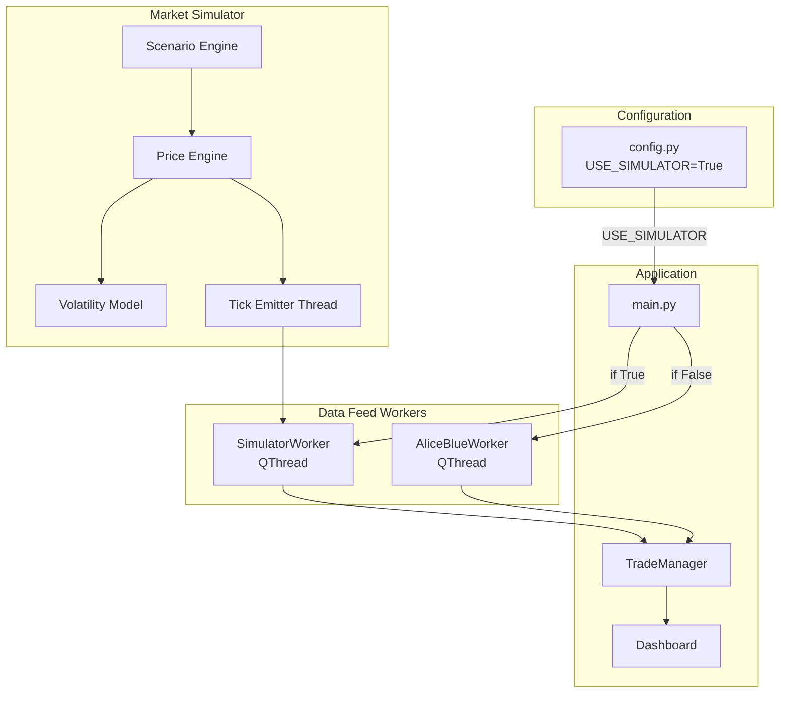
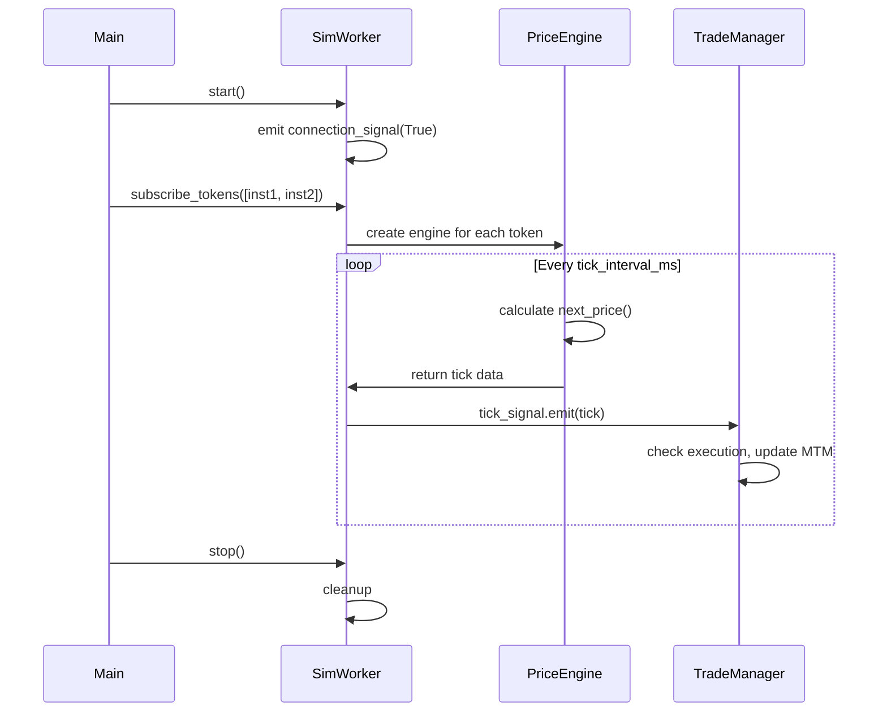

# Market Tick Simulator Plan

## Overview

Create a realistic market tick simulator that replaces AliceBlueWorker for testing outside market hours. Uses a configurable price model with volatility clustering, mean reversion, and occasional spikes.

## Todos

- [ ] Create core/market_simulator.py with PriceEngine class (GBM + volatility clustering + jumps)
- [ ] Create core/simulator_worker.py with SimulatorWorker QThread (same interface as AliceBlueWorker)
- [ ] Update config.py with USE_SIMULATOR flag and simulation parameters
- [ ] Update main.py to conditionally use SimulatorWorker or AliceBlueWorker
- [ ] Create test_simulator.py for standalone simulation testing

---

## Architecture Overview



## Price Model Design

The simulator uses a **Geometric Brownian Motion (GBM)** model enhanced with:

1. **Volatility Clustering** - High volatility periods tend to cluster (GARCH-like behavior)
2. **Mean Reversion** - Prices tend to revert to a moving average over time
3. **Jump Diffusion** - Occasional large price spikes (news events)
4. **Bid-Ask Spread** - Realistic spread that widens during high volatility

### Price Update Formula

```
next_price = current_price * (1 + drift + volatility * random_shock + jump)

Where:
- drift: Small upward/downward bias (configurable trend)
- volatility: Dynamic, with clustering effect
- random_shock: Normal distribution N(0, 1)
- jump: Rare large moves (Poisson-triggered)
```

---

## Files to Create/Modify

| File | Action | Description |
|------|--------|-------------|
| `core/market_simulator.py` | **New** | Price engine, volatility model, tick generation |
| `core/simulator_worker.py` | **New** | QThread worker that emits ticks (same interface as AliceBlueWorker) |
| `config.py` | Modify | Add USE_SIMULATOR flag and simulation parameters |
| `main.py` | Modify | Conditionally use SimulatorWorker or AliceBlueWorker |

---

## Component Details

### 1. Price Engine (`core/market_simulator.py`)

```python
class PriceEngine:
    """Generates realistic price movements."""
    
    def __init__(self, initial_price, volatility=0.02, trend=0.0):
        self.price = initial_price
        self.base_volatility = volatility
        self.current_volatility = volatility
        self.trend = trend  # Daily drift
        
    def next_tick(self) -> float:
        # Update volatility (clustering)
        # Apply mean reversion
        # Add random shock
        # Occasional jump
        return new_price
```

Key parameters:
- `volatility`: Base volatility (0.02 = 2% daily, typical for NIFTY options)
- `trend`: Directional bias (-0.01 to +0.01)
- `mean_reversion_speed`: How fast price reverts to average
- `jump_probability`: Chance of large move per tick

### 2. Instrument Simulator

```python
class InstrumentSimulator:
    """Manages price simulation for a single instrument."""
    
    def __init__(self, token, symbol, initial_price, config):
        self.token = token
        self.symbol = symbol
        self.engine = PriceEngine(initial_price, **config)
        self.last_price = initial_price
```

### 3. Simulator Worker (`core/simulator_worker.py`)

Mirrors `AliceBlueWorker` interface exactly:

```python
class SimulatorWorker(QThread):
    # Same signals as AliceBlueWorker
    connection_signal = pyqtSignal(bool, str)
    tick_signal = pyqtSignal(dict)
    error_signal = pyqtSignal(str)
    
    def subscribe_tokens(self, instruments):
        """Add instruments to simulation."""
        
    def unsubscribe_tokens(self, instruments):
        """Remove instruments from simulation."""
        
    def stop(self):
        """Stop the simulation."""
```

### 4. Configuration (`config.py`)

```python
# Simulation Mode
USE_SIMULATOR = True  # Set to False for real market data

# Simulation Parameters
SIMULATOR_CONFIG = {
    "tick_interval_ms": 500,      # Tick every 500ms
    "base_volatility": 0.015,     # 1.5% daily volatility
    "volatility_clustering": 0.7, # GARCH alpha (0-1)
    "mean_reversion_speed": 0.05, # Speed of mean reversion
    "jump_probability": 0.001,    # 0.1% chance of jump per tick
    "jump_magnitude": 0.02,       # 2% jump size
    "trend": 0.0,                 # Neutral trend (0 = sideways)
}

# Pre-defined scenarios (optional)
SIMULATION_SCENARIOS = {
    "trending_up": {"trend": 0.005, "volatility": 0.01},
    "trending_down": {"trend": -0.005, "volatility": 0.01},
    "high_volatility": {"trend": 0.0, "volatility": 0.03},
    "sl_test": {"trend": -0.01, "volatility": 0.02},  # Price drops to hit SL
    "target_test": {"trend": 0.01, "volatility": 0.02},  # Price rises to hit target
}
```

### 5. Main.py Integration

```python
# In main.py
from config import USE_SIMULATOR

if USE_SIMULATOR:
    from core.simulator_worker import SimulatorWorker
    self.worker = SimulatorWorker()
    self.ui.append_log("SIMULATION MODE - Using simulated market data")
else:
    from core.data_feed import AliceBlueWorker
    self.worker = AliceBlueWorker(USER_ID, API_KEY)
```

---

## Tick Data Format

Simulator emits ticks in the same format as Alice Blue:

```python
tick = {
    'token': 12345,
    'ltp': 152.50,           # Last traded price
    'pc': 2.5,               # Percent change from open
    'v': 1000,               # Volume (simulated)
    'bp': 152.45,            # Best bid price
    'sp': 152.55,            # Best ask price (offer)
    'ts': '2025-12-19 14:30:15'  # Timestamp
}
```

---

## Simulation Flow



---

## Testing Scenarios

The simulator supports pre-defined scenarios for targeted testing:

| Scenario | Description | Use Case |
|----------|-------------|----------|
| `trending_up` | Steady upward movement | Test target hits |
| `trending_down` | Steady downward movement | Test stop-loss hits |
| `high_volatility` | Large price swings | Test rapid P&L changes |
| `sideways` | Range-bound movement | Test order expiry |
| `flash_crash` | Sudden drop then recovery | Test extreme conditions |

Usage:
```python
# In test script or config
simulator.set_scenario("trending_up", token=12345)
```

---

## Implementation Order

1. Create `core/market_simulator.py` with PriceEngine and InstrumentSimulator
2. Create `core/simulator_worker.py` with same interface as AliceBlueWorker
3. Update `config.py` with simulation settings
4. Update `main.py` to conditionally use simulator
5. Create `test_simulator.py` for standalone testing


Market Tick Simulator - Implementation Complete
Files Created
File	Description
core/market_simulator.py	Price engine with GBM, volatility clustering, mean reversion, and jump diffusion
core/simulator_worker.py	QThread worker (drop-in replacement for AliceBlueWorker)
test_simulator.py	Comprehensive test suite
Files Modified
File	Changes
config.py	Added USE_SIMULATOR flag and SIMULATOR_CONFIG parameters
main.py	Conditionally loads SimulatorWorker or AliceBlueWorker
How to Use
1. Enable Simulation Mode
In config.py:
USE_SIMULATOR = True  # Set to False for real market data
USE_SIMULATOR = True  # Set to False for real market data
2. Run the Application
cd paper_trade_app
python main.py
cd paper_trade_apppython main.py
The window title will show "SIMULATION MODE" when active.
3. Test the Simulator Independently
# Quick test (all components)
python test_simulator.py --test quick

# Test price engine only
python test_simulator.py --test engine

# Test all scenarios
python test_simulator.py --test scenarios

# Full integration test with TradeManager (10 seconds)
python test_simulator.py --test worker

# Dynamic scenario switching
python test_simulator.py --test dynamic
# Quick test (all components)python test_simulator.py --test quick# Test price engine onlypython test_simulator.py --test engine# Test all scenariospython test_simulator.py --test scenarios# Full integration test with TradeManager (10 seconds)python test_simulator.py --test worker# Dynamic scenario switchingpython test_simulator.py --test dynamic
4. Available Scenarios
sideways - Range-bound movement
trending_up - Steady upward (test targets)
trending_down - Steady downward (test stop-losses)
high_volatility - Large swings
sl_test - Designed to trigger stop-losses
target_test - Designed to trigger targets
flash_crash - Sudden drops with recovery
recovery_rally - Strong upward with jumps
sideways - Range-bound movement
trending_up - Steady upward (test targets)
trending_down - Stea